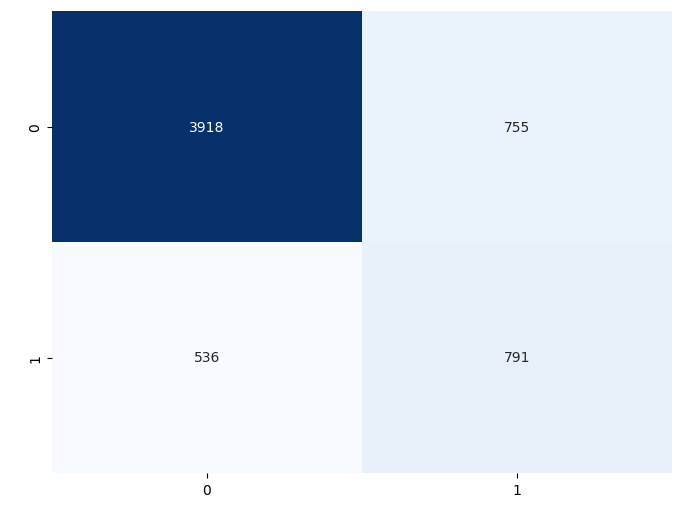
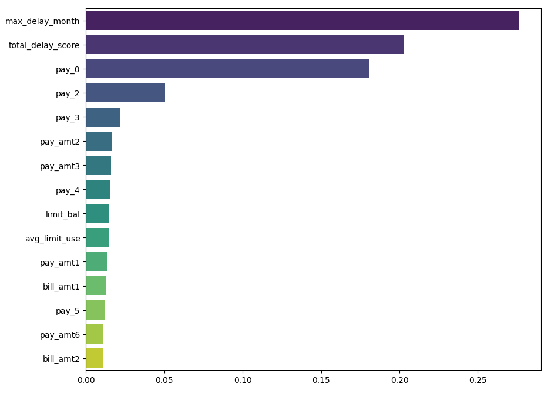
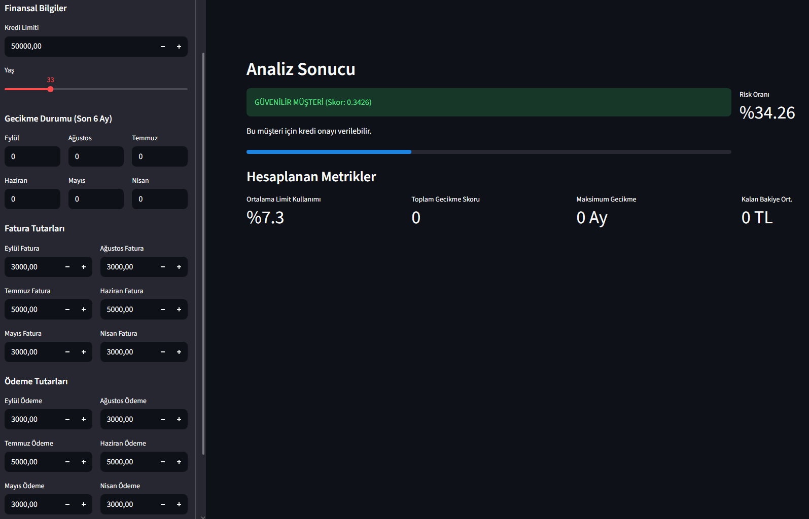

# End-to-End Credit Risk Prediction System

Bu proje, **Machine Learning Bootcamp** kapsamında geliştirilmiş uçtan uca bir Kredi Risk Tahminleme sistemidir. Finansal verileri kullanarak müşterilerin temerrüde düşme (borcunu ödememe) ihtimalini hesaplar.

## Proje Amacı ve Kapsamı
Bankacılık sektöründe batık kredilerin (churn/default) önceden tespiti hayati önem taşır. Bu projede:
* Geçmiş ödeme verileri ve finansal limitler analiz edilmiştir.
* Dengesiz veri seti (Imbalanced Dataset) üzerinde çalışılmıştır.
* **XGBoost** algoritması ile %78 doğruluk oranına sahip bir model geliştirilmiştir.
* Model, **Streamlit** ile canlı bir web uygulamasına dönüştürülmüştür.

## Kullanılan Teknolojiler
* **Python 3.10+**
* **Veri Analizi:** Pandas, NumPy
* **Görselleştirme:** Matplotlib, Seaborn
* **Makine Öğrenmesi:** Scikit-learn, XGBoost (RandomizedSearchCV ile optimize edildi)
* **Arayüz (Deployment):** Streamlit
* **Model Kayıt:** Joblib

## Model Performansı ve Sonuçlar
Modelin başarısı "Recall" (Riskli müşteriyi yakalama) metriği üzerine optimize edilmiştir.

| Metrik | Skor | Açıklama |
| :--- | :--- | :--- |
| **ROC AUC** | **0.7821** | Modelin sınıf ayırma başarısı yüksektir. |
| **Recall (Riskli)** | **0.60** | Batacak müşterilerin %60'ı tespit edilmektedir. |
| **Accuracy** | **0.78** | Genel doğruluk oranı. |

### Confusion Matrix & Feature Importance
Model karar verirken en çok **"Maksimum Gecikme Süresi" (max_delay_month)** ve **"Toplam Gecikme Skoru"** özelliklerine odaklanmaktadır.



*Şekil 1: Modelin tahmin başarısını gösteren karışıklık matrisi.*



*Şekil 2: Modelin karar verirken en çok önem verdiği özellikler.*

## Uygulama Arayüzü (Demo)
Model, son kullanıcıların kolayca risk sorgulaması yapabileceği bir arayüze entegre edilmiştir.



### Örnek Test Senaryoları
Modeli test etmek için aşağıdaki değerleri arayüzde girerek sonuçları gözlemleyebilirsiniz:

#### Senaryo 1: Güvenilir Müşteri (Düşük Risk)
Bu profildeki müşteri borçlarını zamanında ödemektedir ve limitini dengeli kullanmaktadır.
* **Kredi Limiti:** 50,000 TL
* **Gecikme Durumları (Tüm Aylar):** 0 (Gecikme Yok)
* **Fatura Tutarları:** Ortalama 3,000 - 5,000 TL
* **Ödeme Tutarları:** Fatura tutarıyla aynı (Tam ödeme)
* **Beklenen Sonuç:** `GÜVENİLİR MÜŞTERİ` (Risk Skoru < 0.50)

#### Senaryo 2: Riskli Müşteri (Yüksek Risk) 
Bu profildeki müşteri son aylarda ödemelerini aksatmış ve limitini zorlamaktadır.
* **Kredi Limiti:** 20,000 TL
* **Gecikme Durumları:** Eylül (2), Ağustos (2), Diğerleri (0)
* **Fatura Tutarları:** 18,000 TL (Limite çok yakın)
* **Ödeme Tutarları:** 0 TL (Hiç ödeme yapmamış)
* **Beklenen Sonuç:** `RİSKLİ MÜŞTERİ` (Risk Skoru > 0.50)


## Kurulum ve Çalıştırma

Projeyi lokalinizde çalıştırmak için adımları izleyin:

1. **Repoyu klonlayın:**
   ```bash
   git clone [https://github.com/KULLANICI_ADINIZ/credit-risk-project.git](https://github.com/KULLANICI_ADINIZ/credit-risk-project.git)
   cd credit-risk-project
   
2. **Gerekli Kütüphaneleri Yükleyin:**
   ```bash
   pip install -r requirements.txt

3. **Uygulamayı Başlatın:**
   ```bash
   python -m streamlit run app.py

CreditRiskProject/

├── data/                  # Ham veri seti (CSV)

├── models/                # Eğitilmiş final model (.pkl) ve özellik setleri

├── notebooks/             # Analiz ve modelleme aşamaları (EDA, Baseline, Pipeline)

├── images/                # Readme için ekran görüntüleri

├── app.py                 # Streamlit web uygulaması

├── requirements.txt       # Proje bağımlılıkları

└── README.md              # Proje dokümantasyonu
